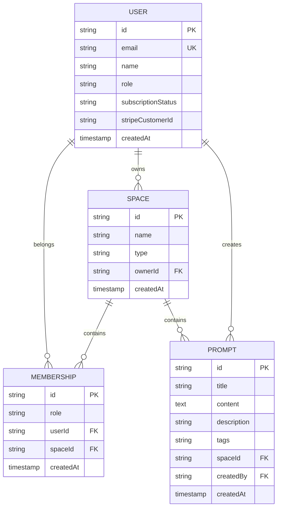

# AI 提示词管理平台

一个高效、可扩展的AI提示词管理平台，基于 Next.js 14 和空间中心化的架构设计，支持个人和团队协作。

## 🎯 项目特性

### 核心功能
- **🔐 安全认证**: Better Auth + OAuth (Google/GitHub) 双重认证
- **📝 提示词管理**: 创建、编辑、删除、标签管理
- **🏢 空间中心化**: 支持个人空间，为未来团队版本做好准备
- **⚡ 实时同步**: SSE 长连接实现实时更新
- **💳 订阅计费**: Stripe 集成，支持多层级订阅
- **👑 管理后台**: 完整的用户和平台数据管理

### 技术亮点
- **未来兼容**: 数据结构设计支持无缝扩展到团队协作
- **API 规范**: 严格的 GET/POST API 设计，便于前端集成
- **类型安全**: 完整的 TypeScript 类型定义
- **权限控制**: 细粒度的用户权限和资源访问控制

## 🛠 技术栈

### 后端核心
- **框架**: Next.js 14 (App Router)
- **语言**: TypeScript
- **数据库**: SQLite/libSQL + Drizzle ORM
- **认证**: Better Auth
- **支付**: Stripe
- **实时通信**: Server-Sent Events (SSE)

### 关键依赖
```json
{
  "better-auth": "^1.3.6",
  "drizzle-orm": "^0.44.4",
  "@libsql/client": "^0.10.0",
  "better-sqlite3": "^12.2.0",
  "stripe": "^14.12.0",
  "zod": "^3.22.4",
  "next": "14.2.3"
}
```

## 🚀 快速开始

### 1. 环境配置

```bash
# 克隆项目
git clone <your-repo>
cd prompt-hub

# 复制环境变量配置
cp .env.example .env
```

#### 依赖安装

由于 Windows 环境下 better-sqlite3 编译问题，推荐使用 Bun 作为包管理器：

```bash
# 方案1: 使用 Bun (推荐)
npm install -g bun
bun install
bun pm trust --all

# 方案2: 使用 npm (可能遇到编译问题)
npm install

# 方案3: 使用 yarn 替代
npm install -g yarn
yarn install
```

**注意**: 如果使用 npm 遇到 better-sqlite3 安装失败，请切换到 Bun。

### 2. 配置环境变量

编辑 `.env` 文件，填入必要的配置：

```env
# 数据库配置
DB_FILE_NAME=file:sqlite.db

# Better Auth 配置
BETTER_AUTH_SECRET=your-better-auth-secret-key
BETTER_AUTH_URL=http://localhost:3000

# OAuth 配置
GOOGLE_CLIENT_ID=your-google-client-id
GOOGLE_CLIENT_SECRET=your-google-client-secret

GITHUB_CLIENT_ID=your-github-client-id
GITHUB_CLIENT_SECRET=your-github-client-secret

# Stripe 配置
STRIPE_SECRET_KEY=sk_test_your-stripe-secret-key
STRIPE_PUBLISHABLE_KEY=pk_test_your-stripe-publishable-key
STRIPE_WEBHOOK_SECRET=whsec_your-webhook-secret

# 产品价格 ID
STRIPE_PRO_PRICE_ID=price_pro_monthly
STRIPE_TEAM_PRICE_ID=price_team_monthly

# 前端 URL
FRONTEND_URL=http://localhost:3000

# 开发环境标识
NODE_ENV=development
```

### 3. 数据库初始化

```bash
# 生成数据库迁移
npx drizzle-kit generate

# 执行迁移
npx drizzle-kit migrate
```

### 4. 启动开发服务器

```bash
# 使用 Bun
bun run dev

# 或使用 npm
npm run dev
```

访问 `http://localhost:3000` 即可开始使用。

### 5. 常见问题解决

#### better-sqlite3 安装失败

如果遇到以下错误：
```
gyp ERR! configure error
subprocess.CalledProcessError: Command returned non-zero exit status 1
```

**解决方案**：
1. 使用 Bun 替代 npm: `bun install`
2. 配置镜像源:
   ```bash
   npm config set registry https://registry.npmmirror.com
   $env:BETTER_SQLITE3_BINARY_HOST="https://npmmirror.com/mirrors/better-sqlite3"
   npm install
   ```
3. 使用 yarn: `yarn install`

## 📊 数据库设计

### 核心表结构



## 🔌 API 接口

### 认证相关
- `POST /api/auth/register` - 用户注册
- `POST /api/auth/login` - 用户登录
- `GET /api/auth/oauth/google` - Google OAuth
- `GET /api/auth/oauth/github` - GitHub OAuth
- `GET /api/auth/me` - 获取当前用户信息
- `POST /api/auth/newuser` - 创建新用户

### 提示词管理
- `POST /api/prompts/create` - 创建提示词
- `GET /api/prompts/list` - 获取提示词列表
- `POST /api/prompts/update` - 更新提示词
- `POST /api/prompts/delete` - 删除提示词
- `POST /api/prompts/use` - 使用提示词
- `GET /api/prompts/stats` - 提示词统计

### 实时通信
- `GET /api/sse` - 建立 SSE 连接

### 订阅计费
- `POST /api/billing/create-checkout-session` - 创建支付会话
- `POST /api/billing/webhook` - Stripe Webhook

### 用户管理
- `GET /api/user/subscription` - 获取用户订阅信息
- `POST /api/user/update` - 更新用户信息
- `GET /api/user/ai-points` - 获取AI点数
- `POST /api/user/purchase-ai-points` - 购买AI点数

### 管理后台
- `GET /api/admin/users/list` - 用户列表
- `POST /api/admin/users/update` - 更新用户
- `GET /api/admin/stats/get` - 平台统计
- `GET /api/admin/prompts/list` - 管理员提示词列表
- `GET /api/admin/prompts/popular` - 热门提示词
- `GET /api/admin/logs/list` - 系统日志

## 🔒 安全设计

### 认证流程
1. 用户注册时自动创建个人空间
2. Better Auth 处理用户认证和会话管理
3. 中间件验证所有API请求
4. 管理员路由需要 ADMIN 角色

### 权限控制
- **资源隔离**: 所有提示词属于特定空间
- **所有权验证**: 用户只能操作自己空间的资源
- **角色区分**: USER 和 ADMIN 不同权限

## 📈 扩展性设计

### 团队版准备
- 空间类型支持 `PERSONAL` 和 `TEAM`
- 成员关系表支持多用户协作
- 权限系统支持 `ADMIN` 和 `MEMBER` 角色

### Monorepo 兼容
- 核心类型定义可独立为包
- 业务逻辑层可共享
- API 客户端可复用

## 🔧 开发指南

### 项目结构
```
src/
├── app/
│   ├── api/                 # API 路由
│   │   ├── auth/           # 认证相关
│   │   ├── prompts/        # 提示词管理
│   │   ├── admin/          # 管理后台
│   │   ├── billing/        # 订阅计费
│   │   └── sse/           # 实时通信
│   └── [lang]/            # 国际化页面
├── lib/
│   ├── database.ts        # 数据库连接
│   ├── utils.ts          # 工具函数
│   └── services.ts       # 业务逻辑
├── components/           # React 组件
├── i18n/                # 国际化配置
├── drizzle-schema.ts    # 数据库模型
└── middleware.ts        # 路由中间件
```

### 添加新功能
1. 在 `drizzle-schema.ts` 中定义数据模型
2. 在 `services.ts` 中添加业务逻辑
3. 创建对应的 API 路由
4. 更新中间件权限检查

## 📝 环境变量说明

| 变量名 | 说明 | 必需 |
|--------|------|------|
| `DB_FILE_NAME` | SQLite/libSQL 数据库文件路径 | ✅ |
| `BETTER_AUTH_SECRET` | Better Auth 签名密钥 | ✅ |
| `BETTER_AUTH_URL` | Better Auth 基础URL | ✅ |
| `GOOGLE_CLIENT_ID` | Google OAuth 客户端ID | ❌ |
| `GITHUB_CLIENT_ID` | GitHub OAuth 客户端ID | ❌ |
| `STRIPE_SECRET_KEY` | Stripe 私钥 | ❌ |
| `STRIPE_PUBLISHABLE_KEY` | Stripe 公钥 | ❌ |
| `STRIPE_WEBHOOK_SECRET` | Stripe Webhook 密钥 | ❌ |
| `STRIPE_PRO_PRICE_ID` | Pro订阅价格ID | ❌ |
| `STRIPE_TEAM_PRICE_ID` | Team订阅价格ID | ❌ |
| `FRONTEND_URL` | 前端URL | ✅ |

## 📚 文档导航

- [安装指南](./docs/INSTALL.md)
- [部署指南](./docs/DEPLOYMENT.md)
- [项目概述](./docs/PROJECT_SUMMARY.md)

## 🤝 贡献指南

1. Fork 项目
2. 创建功能分支: `git checkout -b feature/amazing-feature`
3. 提交更改: `git commit -m 'Add amazing feature'`
4. 推送分支: `git push origin feature/amazing-feature`
5. 提交 Pull Request

## 📄 许可证

MIT License - 详见 [LICENSE](LICENSE) 文件

## 🎉 致谢

感谢所有贡献者和开源社区的支持！